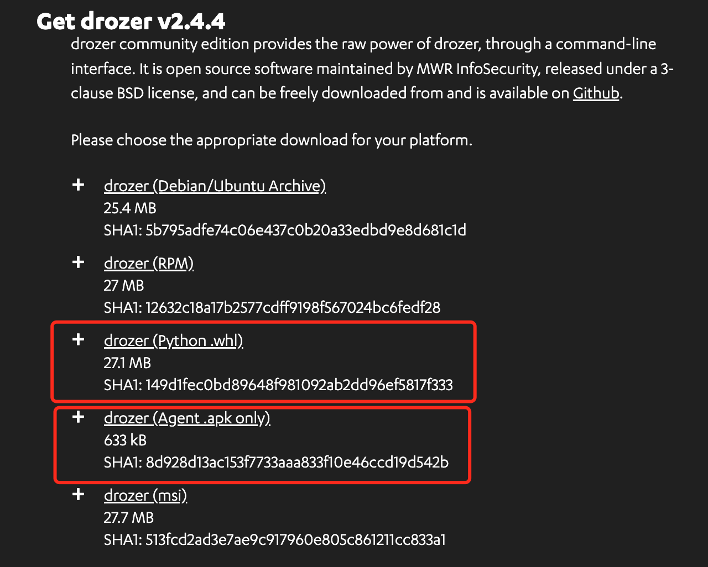
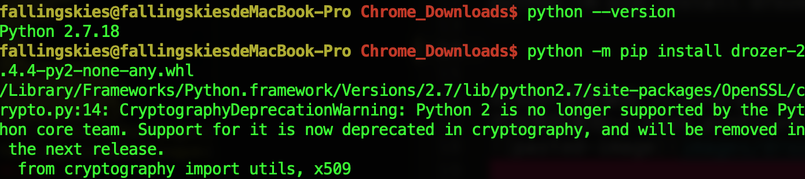
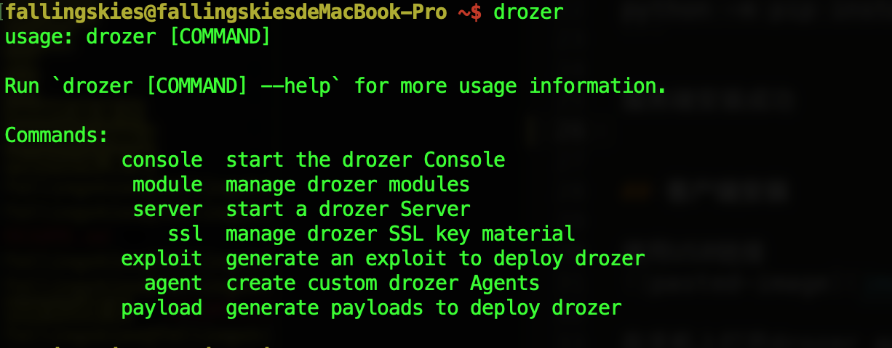
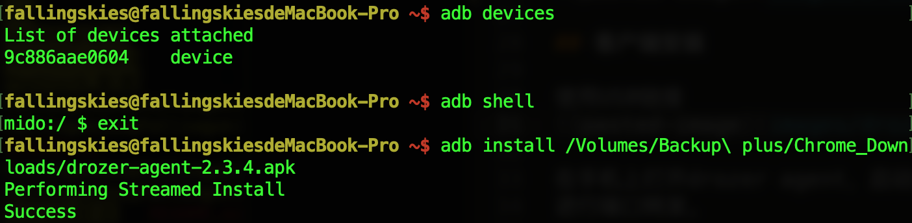
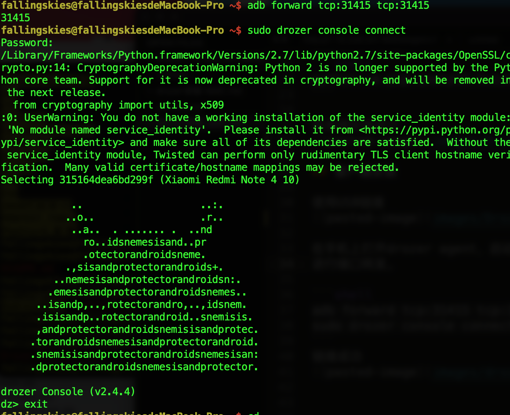

# Drozer安装
环境：MAC
     小米note4

Drozer分为服务端与客户端，需要分别在电脑和手机端安装。
（Drozer仅支持python2）
进入官网：https://labs.f-secure.com/tools/drozer/


## 服务端安装
```shell
python -m pip install drozer-2.4.4-py2-none-any.whl
```


drozer会安装在 /Library/Frameworks/Python.framework/Versions/2.7/bin 目录下（根据跟人环境不同）
可以将目录在~/.bash_profile中设置为环境变量


安装twisted插件
```shell
python -m pip install twisted
```

服务端安装成功


## 客户端安装

使用USB链接


在手机上打开drozer agent，启动。
进行端口转发。

```shell
adb forward tcp:31415 tcp:31415
sudo drozer console connect
```
链接成功



