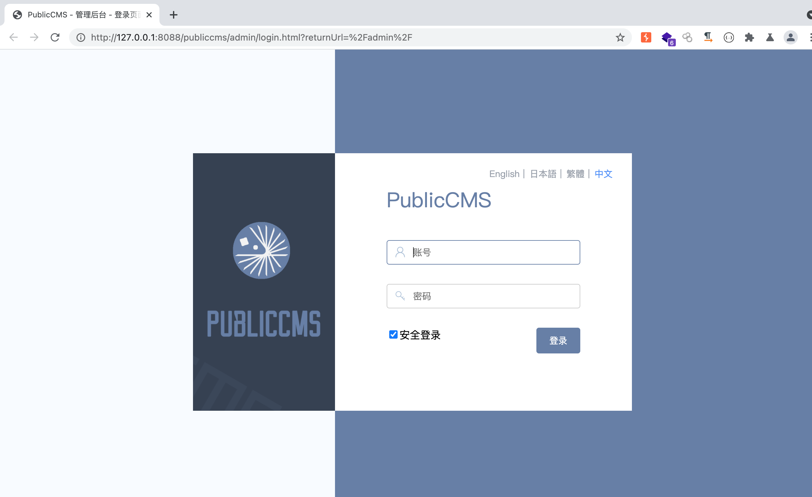
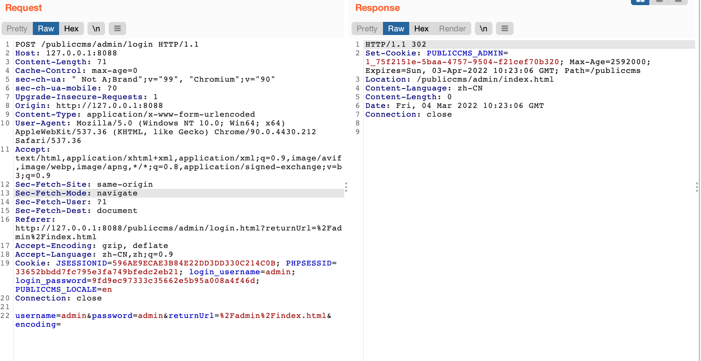
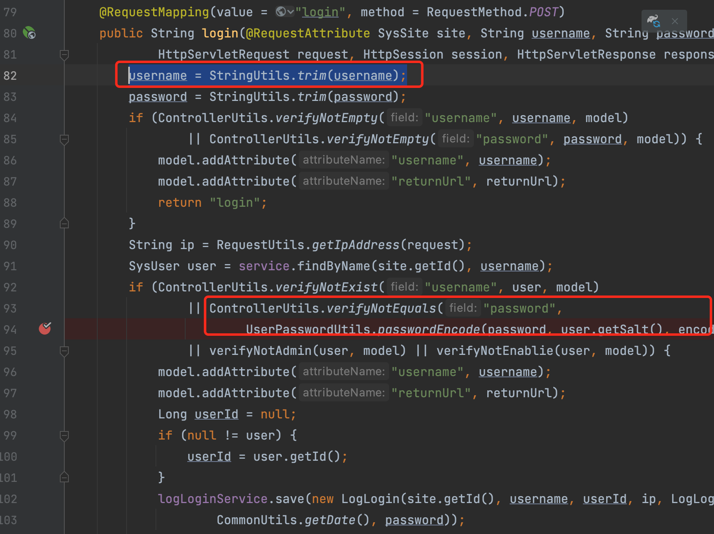
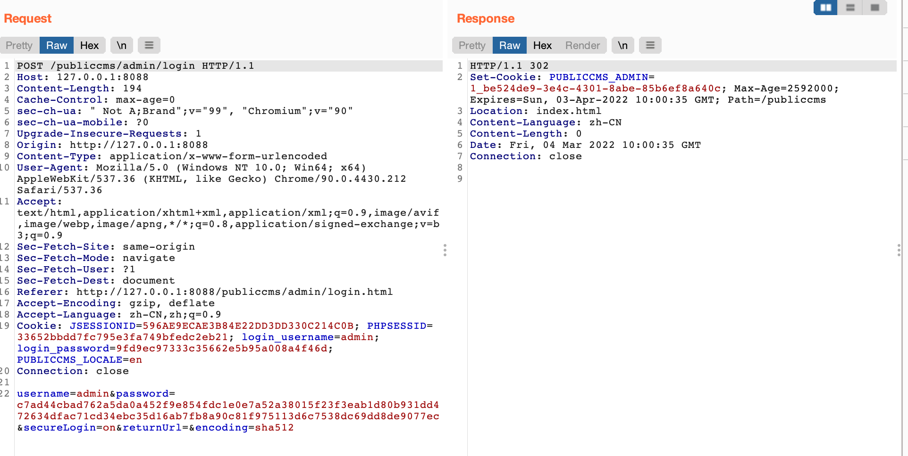
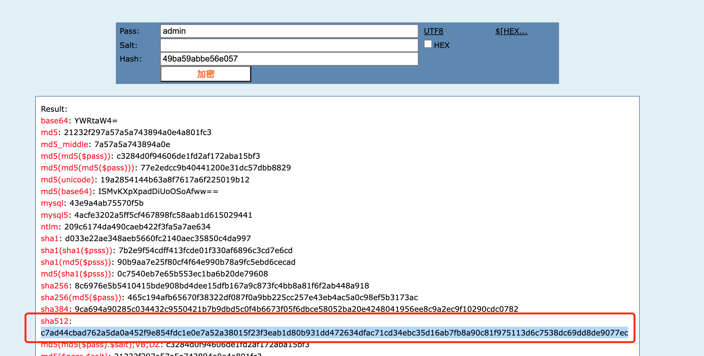

## 前言

PublicCMS版本：v4.0.202107

后台登陆界面如下


登陆抓包


根据url定位到
`publiccms-parent/publiccms-core/src/main/java/com/publiccms/controller/admin/LoginAdminController.java`

## 代码分析

代码如下
```java
    /**
     * @param site
     * @param username
     * @param password
     * @param returnUrl
     * @param encoding
     * @param request
     * @param session
     * @param response
     * @param model
     * @return view name
     */
    @RequestMapping(value = "login", method = RequestMethod.POST)
    public String login(@RequestAttribute SysSite site, String username, String password, String returnUrl, String encoding,
            HttpServletRequest request, HttpSession session, HttpServletResponse response, ModelMap model) {
        username = StringUtils.trim(username);
        password = StringUtils.trim(password);
        if (ControllerUtils.verifyNotEmpty("username", username, model)
                || ControllerUtils.verifyNotEmpty("password", password, model)) {
            model.addAttribute("username", username);
            model.addAttribute("returnUrl", returnUrl);
            return "login";
        }
        String ip = RequestUtils.getIpAddress(request);
        SysUser user = service.findByName(site.getId(), username);
        if (ControllerUtils.verifyNotExist("username", user, model)
                || ControllerUtils.verifyNotEquals("password",
                        UserPasswordUtils.passwordEncode(password, user.getSalt(), encoding), user.getPassword(), model)
                || verifyNotAdmin(user, model) || verifyNotEnablie(user, model)) {
            model.addAttribute("username", username);
            model.addAttribute("returnUrl", returnUrl);
            Long userId = null;
            if (null != user) {
                userId = user.getId();
            }
            logLoginService.save(new LogLogin(site.getId(), username, userId, ip, LogLoginService.CHANNEL_WEB_MANAGER, false,
                    CommonUtils.getDate(), password));
            return "login";
        }

        ControllerUtils.setAdminToSession(session, user);
        if (UserPasswordUtils.needUpdate(user.getSalt())) {
            String salt = UserPasswordUtils.getSalt();
            service.updatePassword(user.getId(), UserPasswordUtils.passwordEncode(password, salt, encoding), salt);
        }
        if (!user.isWeakPassword() && UserPasswordUtils.isWeek(username, password)) {
            service.updateWeekPassword(user.getId(), true);
        }
        service.updateLoginStatus(user.getId(), ip);
        String authToken = UUID.randomUUID().toString();
        Date now = CommonUtils.getDate();
        Map<String, String> config = configComponent.getConfigData(site.getId(), Config.CONFIG_CODE_SITE);
        int expiryMinutes = ConfigComponent.getInt(config.get(LoginConfigComponent.CONFIG_EXPIRY_MINUTES_MANAGER),
                LoginConfigComponent.DEFAULT_EXPIRY_MINUTES);
        sysUserTokenService.save(new SysUserToken(authToken, site.getId(), user.getId(), LogLoginService.CHANNEL_WEB_MANAGER, now,
                DateUtils.addMinutes(now, expiryMinutes), ip));
        StringBuilder sb = new StringBuilder();
        sb.append(user.getId()).append(CommonConstants.getCookiesUserSplit()).append(authToken);
        RequestUtils.addCookie(request.getContextPath(), response, CommonConstants.getCookiesAdmin(), sb.toString(),
                expiryMinutes * 60, null);
        logLoginService.save(new LogLogin(site.getId(), username, user.getId(), ip, LogLoginService.CHANNEL_WEB_MANAGER, true,
                CommonUtils.getDate(), null));
        String safeReturnUrl = config.get(LoginConfigComponent.CONFIG_RETURN_URL);
        if (ControllerUtils.isUnSafeUrl(returnUrl, site, safeReturnUrl, request)) {
            returnUrl = CommonConstants.getDefaultPage();
        }
        return UrlBasedViewResolver.REDIRECT_URL_PREFIX + returnUrl;
    }
```

我们重点关注两部分

首先，服务器会对传入用户名和密码做去除空格的处理。（没啥用，就是注意下）

关键还是关注校验密码部分的逻辑。

可以注意到代码中有两个大的if段。
第一个if是检查用户名和密码是否为空。（使用||来链接两个判断，如果两个判断有一个返回True，就进入if逻辑里，即返回login界面，需要两个都为False，才可以继续执行后续流程）

第二个if就是检查用户名是否存在、密码是否匹配、用户是否有Admin权限、是否允许账号登陆。

只关注关键的密码是否匹配的流程。

注意到登陆界面有一个安全登陆选项，勾选上之后抓包，看有什么不同。


多了一个encoding参数，securelogin参数，并且密码经过加密。

查看passwordEncode函数
```java
public class UserPasswordUtils {
    private static final int SALT_LENGTH = 10;
    private static final String ENCODE_SHA512 = "sha512";
    private static final int WEAK_PASSWORD_LENGTH = 5;
    private static final Pattern WEAK_PASSWORD_PATTERN = Pattern.compile("\\d*|[a-z]*|[A-Z]*");

    public static String passwordEncode(String password, String salt, String encode) {
        if (null != salt && SALT_LENGTH == salt.length()) {
            if (ENCODE_SHA512.equalsIgnoreCase(encode)) {
                return VerificationUtils.sha512Encode(password + salt);
            } else {
                return VerificationUtils.sha512Encode(VerificationUtils.sha512Encode(password) + salt);
            }
        } else {
            return VerificationUtils.md5Encode(password);
        }
    }
```
这里判断了是否有salt，且salt是否满足长度要求。（这里就不跟salt生成了，默认是每个创建账号都会自动生成一个随机的salt）

判断encode参数是否为sha512，如果是的话就将password加上salt使用sha512进行哈希（安全模式）

如果encode不是sha512，就将password进行sha512后，再执行上述操作。（正常模式）

那么，后台用户存储的密码[user.getPassword()]肯定是一样的。

就是说安全模式传入的password即是password进行sha512后的值。

验证一下，确实是这样的。



